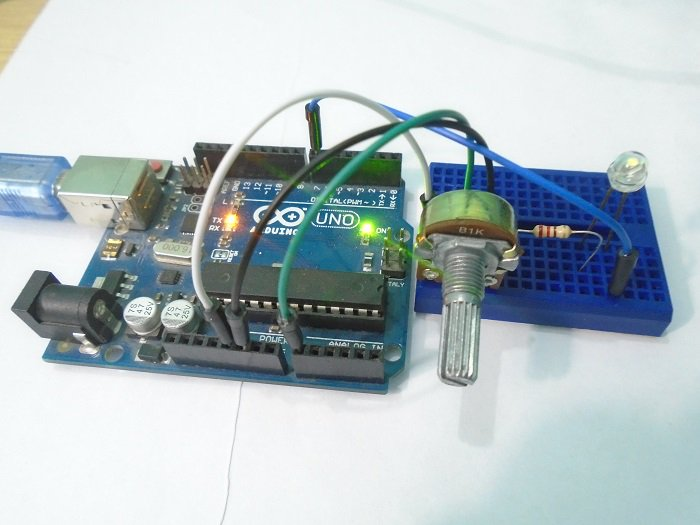
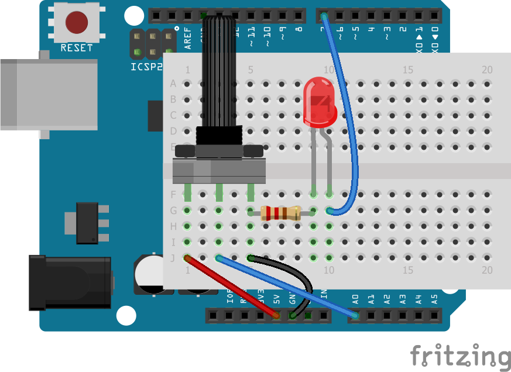
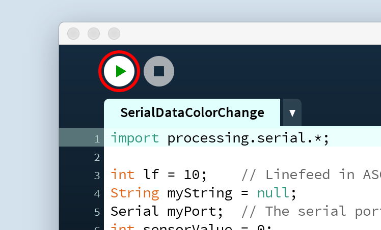

Kleur en potmeter
=================

Om te beginnen gaan we de kleur van een schets in Processing veranderen met een potentiometer. Een potentiometer is een draaiknop. Met een Arduino kun je de stand van de knop uitlezen en die waarde doorsturen naar de computer. 

We zullen ook een LED-lampje aan- en uitzetten door met de muis op de schets in Processing te klikken.

(Bron: https://maker.pro/arduino/tutorial/how-to-make-arduino-and-processing-ide-communicate )

Benodigdheden
+++++++++++++

Eerst zul je de programma's van Processing en Arduino moeten installeren. We noemen het programma van beide ook wel de
ontwikkelomgeving of *IDE*. Als je die al op je computer hebt staan dan kun je deze stap overslaan.

Het Processing-programma kun je hier downloaden: https://processing.org/download/

De Arduino-software kun je hier downloaden: https://www.arduino.cc/en/Main/Software
Onder het kopje 'Download the Arduino IDE' kun je het bestand voor jouw computer uitkiezen.

Als je ze hebt geïnstalleerd, kun je beide programma's openen. Processing ziet er zo uit:

.. image:: imgs/arduinoprocessing2.png

Stappen
+++++++

1. Maak de schakeling op het breadboard
~~~~~~~~~~~~~~~~~~~~~~~~~~~~~~~~~~~~~~~

Nadat je beide programma's hebt geïnstalleerd, kun je beginnen met het maken van de schakeling. Dit zijn de onderdelen die je nu nodig hebt:

- de Arduino
- een breadboard
- een weerstand
- een potmeter
- draadjes
- een LED-lampje

We gebruiken hier een weerstand van 220 Ohm, met kleurcode rood-rood-bruin-goud, maar elke weerstand met een waarde ergens tussen 100 Ohm en 470 Ohm is prima.

Maak met die componenten de schakeling zoals in dit plaatje:

Het plaatje laat een wit breadboard zien dat bovenop de Arduino ligt. Dat hoeft er bij jou niet net zo uit te zien: misschien heb je een groter breadboard, en dat breadboard mag ook naast de Arduino liggen.

Wat wel precies moet kloppen om het te laten werken, zijn de verbindingen tussen de verschillende onderdelen. Let erop dat de onderdelen alleen met elkaar verbonden zijn als hun pinnetjes in hetzelde rijtje staan, dus zoals op het plaatje.

Verbind de twee buitenste pinnen van de potentiometer met de 5V-pin en de GND-pin van de Arduino. De middelste pin van de potentiometer verbind je met de pin waar A0 bij staat op de Arduino.

Verbind dan het langste pootje van de LED met pin 7 op de Arduino en het korte pootje met de GND-pin via de weerstand.

2. Code voor op de Arduino
~~~~~~~~~~~~~~~~~~~~~~~~~~

Hieronder zie je de code voor op de Arduino. Als je een beetje Engels kunt, dan kun je het commentaar in de code lezen om te zien wat elk stukje doet. 

Kopiëer deze code en zet hem in het venster van de Arduino IDE (maak dat scherm eerst leeg voordat je de code erin plakt).::

    int led_pin = 7;    // Initializing the LED pin
    int pot_pin = A0;   // Initializing the Potentiometer pin
    int pot_output;     // Declaring a variable for potentiometer output

    void setup ( ) {
        pinMode(led_pin, OUTPUT); // Declaring the LED pin as output pin
        Serial.begin(9600);       // Starting the serial communication at 9600 baud rate
    }

    void loop ( ) { 
        pot_output = analogRead (pot_pin); // Reading from the potentiometer
        int mapped_output = map (pot_output, 0, 1023, 0, 255); // Mapping the output of potentiometer to 0-255 to be read by the Processing IDE
        Serial.println (mapped_output);     // Sending the output to Processing IDE

        if (Serial.available ( ) > 0) {   // Checking if the Processing IDE has send a value or not
            char state = Serial.read ( );    // Reading the data received and saving in the state variable

            if (state == '1') {            // If received data is '1', then turn on LED
                digitalWrite (led_pin, HIGH);
            }

            if (state == '0') {     // If received data is '0', then turn off led
                digitalWrite (led_pin, LOW);
            }
        }
        delay(50);
    }

Verbind vervolgens de Arduino met de USB-kabel aan je computer, en klik dan op de upload-knop in de IDE (tweede icoon van links).

Als je een foutmelding krijgt omdat de computer de Arduino niet kan vinden, dan moet je in het menu 'Hulpmiddelen' zorgen dat het juiste bord en de juiste poort zijn geselecteerd. Het bord dat je gebruikt is waarschijnlijk 'Arduino/Genuino Uno' en de poort zou óf iets moeten zijn als COM3 of /dev/cu.wchusbserialfd120 (iets met 'usb' erin).

3. Code voor in Processing
~~~~~~~~~~~~~~~~~~~~~~~~~~

Het Processing-programma zal de gegevens van de Arduino opvangen uit de seriële verbinding via de USB-poort. De code hieronder zorgt ervoor dat de kleur van het Processing-venster zal veranderen op basis van die gegevens.
Deze code stuurt ook een 0 of 1 als je met de linker- of rechtermuisknop op het venster klikt.

Kopiëer deze code en zet hem in Processing::

	import processing.serial.*;    // Importing the serial library to communicate with the Arduino 

	Serial myPort;      // Initializing a vairable named 'myPort' for serial communication
	float background_color ;   // Variable for changing the background color

	void setup() {
		size (500,  500);     // Size of the serial window, you can increase or decrease as you want
		myPort  =  new Serial (this, "COM3",  9600); // Set the com port and the baud rate according to the Arduino IDE
		myPort.bufferUntil ( '\n' );   // Receiving the data from the Arduino IDE
	} 

	void serialEvent  (Serial myPort) {
		background_color  =  float (myPort.readStringUntil ( '\n' ) ) ;  // Changing the background color according to received data
	}

	void draw() {
		background ( 150, 50, background_color );   // Initial background color, when we will open the serial window 
    println(background_color); // write the input from the Arduino to the console
		if ( mousePressed  &&  ( mouseButton  ==  LEFT ) ) { // if the left mouse button is pressed
			myPort.write ( '1' ) ;       // send a '1' to the Arduino IDE
		} 

		if ( mousePressed  &&  ( mouseButton == RIGHT ) ) {  // if the right mouse button is pressed
			myPort.write ( '0' ) ;     // Send a '0' to the Arduino IDE
		}
	}		
	
4. Processing laten praten met de Arduino
~~~~~~~~~~~~~~~~~~~~~~~~~~~~~~~~~~~~~~~~~

De Processing-software kan communiceren met de Arduino via een seriële verbinding. Zo kunnen we dus informatie van de Arduino naar Processing sturen en andersom.

Om te kunnen praten met het Arduino-bordje, zal Processing moeten weten op welke poort van je computer de Arduino is aangesloten. Het kan zijn dat de code meteen werkt, maar misschien moet je in de code iets moeten veranderen om het te laten werken.

In de Arduino IDE zie je rechtsonderin het venster op welke poort het Arduino-bordje is aangesloten. Dat adres vul je in in het script in het Processing-venster.  

Dit is hoe de regel er ongeveer uit zou zien op een Apple-computer::

    myPort = new Serial(this, "/dev/cu.wchusbserialfd120", 9600);

En zo op een PC::

    myPort  =  new Serial (this, "COM3",  9600); 

5. Draaien maar!
~~~~~~~~~~~~~~~~

Als je de code op de Arduino hebt gezet, dan kun je nu Processing met de Arduino laten praten.   

Start het Processing-script door op de 'Play'-knop te klikken: 

Als het goed is, zie je nu een venster dat je van kleur kunt laten veranderen door aan de potentiometer te draaien. De Arduino stuurt een waarde tussen 0 en 255 naar de Processing IDE. De Processing IDE verandert de kleur die je ziet op basis van die waarde.

Probeer ook maar eens om met de linker- en rechtermuisknop op het venster te kliken. Als je alles goed hebt aangesloten, zal het LEDje aan of uitgaan.

6. Kleur veranderen
~~~~~~~~~~~~~~~~~~~

Dit is de regel waarmee Processing de kleur van het venster verandert::
    
    background ( 150, 50, background_color );

De functie background() heeft drie getallen nodig: een getal voor hoeveel rood je ziet, hoeveel groen en hoeveel blauw. De hoeveelheid blauw wordt nu bepaald door de draaiknop.
Kun jij die regel zo veranderen dat je andere kleuren ziet?

Hoe ziet het eruit als je álle kleuren afhankelijk maakt van de knop?

